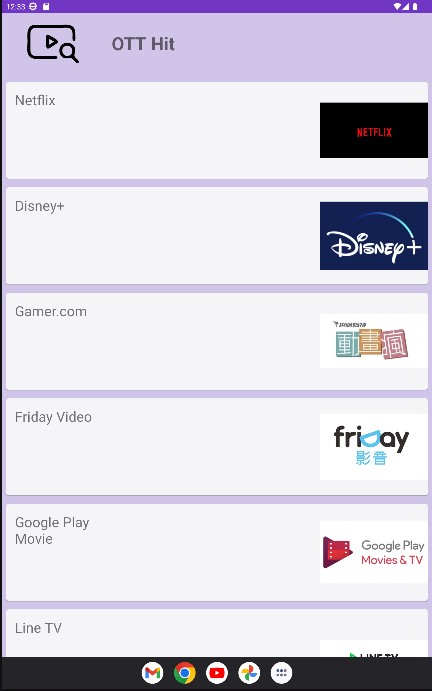

# OTT_Search App
OTT_Search Introduction
Android Studio with Database APP __ Team Project

## 工具

GitHub, Android Studio, json, SQL, python 爬蟲

## OTT影音查詢APP

### 前端
使用 Android Studio 以 Kotlin 書寫，用json和後端做連接 

### 後端
- 先用搜尋爬蟲取得抓到的結果
- 再把這些結果重新製作成一個格式簡單的JSON
- 一次送交給SQL那邊做處理
- 最後用-> 檢查Tag是否存在(存在回傳搜尋值，不存在回0) 來顯示
```
python3 main.py [搜尋字詞]
```

### 特色

- 搜尋功能
- 排行榜
- 深色模式




## ER Model: 


